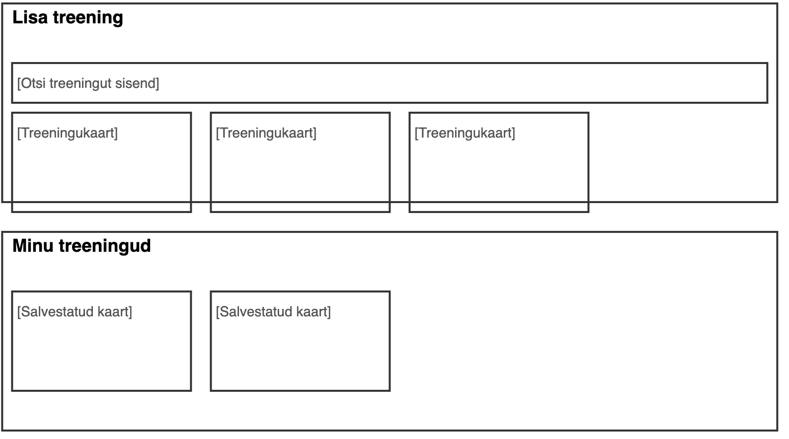

# FitFastFitness – Kasutajaliidese rühmatöö  
Autorid: Susanna Veski ja Kristiin Marleen Suik
- Tegemist on õppeeesmärgil loodud tööga  

FitFastFitness on veebirakendus, mis võimaldab külastajatel:  
- luua konto ja sisse logida  
- sirvida erinevaid treeninguid  
- lisada sobivad treeningud enda "Minu treeningud" lehele  
- hallata "Minu treenigud" treeningute kogu  

Projekt keskendub kasutajasõbraliku, visuaalselt esteetilise ja mobiilivaatega kohanduva liidese loomisele.

## Kasutatud tehnoloogiad  
- HTML  
- SASS  
- JavaScript  
- Google Fonts (Syne ja Poppins)

## Lehe struktuur  
- `index.html` – sisselogimisvaade  
- `register.html` – konto loomise vaade  
- `dashboard.html` – tervitusvaade sisse logitud kasutajale  
- `add-workout.html` – treeningute lisamine  
- `my-workouts.html` – kasutaja lisatud treeningud  
- `meist.html` – platvormi tutvustav leht kontota külastajale
- `style.sass` / `style.css` – kujundus  
- `script.js` – interaktiivne loogika (login, localStorage jms)

## Andmete haldus  
- Kasutaja andmed salvestatakse `localStorage` abil brauserisse  
- Treeningute valikud talletatakse samuti lokaalselt

## Makett

  
  

## Käivitamine  
1. Ava `index.html` brauseris  
2. Loo konto või logi sisse  
3. Kasuta ülemist naviriba, et liikuda lehtede vahel

